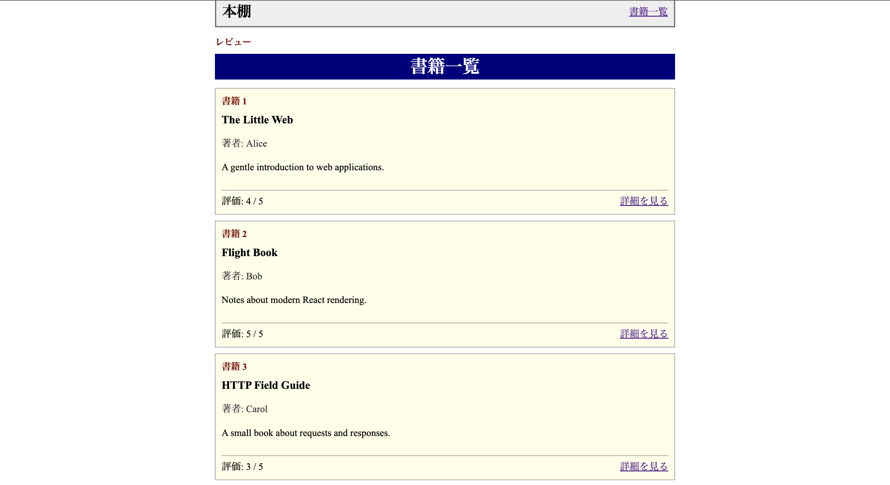
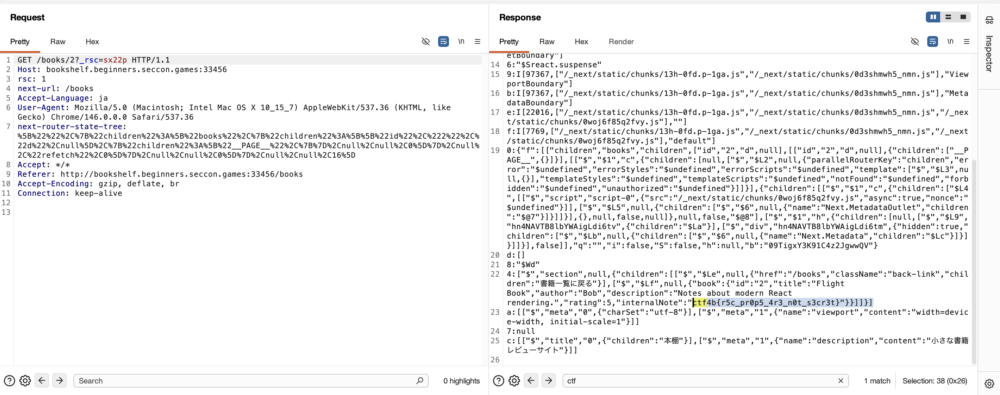

## 問題

`書籍レビューサイトを公開しました。 [URL]`


## 調査
まずは配布されたディレクトリを見る．

```
 > tree
 
.
└── bookshelf
    ├── app
    │   ├── app
    │   │   ├── books
    │   │   │   ├── [id]
    │   │   │   │   ├── BookDetail.tsx
    │   │   │   │   └── page.tsx
    │   │   │   └── page.tsx
    │   │   ├── globals.css
    │   │   ├── layout.tsx
    │   │   └── page.tsx
    │   ├── Dockerfile
    │   ├── next-env.d.ts
    │   ├── next.config.ts
    │   ├── package-lock.json
    │   ├── package.json
    │   └── tsconfig.json
    ├── compose.yaml
    └── nginx
        ├── Dockerfile
        └── nginx.conf

  
7 directories, 15 files
```

わかること: 
- `app/app/`配下に`layout.tsx`/`page.tsx`,`tsconfig.json`/`next.config.ts`/`next-env.d.ts`がある -> App Router構成のNext.jsである．
- 機能は本棚?
  - `app.page.tsx`,`books/page.tsx`,`books/[id]/`


URL踏んで確認してみると，書籍一覧があって，`詳細を見る`をクリックすると，`books/[id]`に対応するみたいですね



`books/[id]`の`[id]`がぱっと見怪しそうなので，`books/[id]/page.tsx`をとりあえず読んでみる．

すると`[id]`が`2`の時にflagが`internalNote`フィールドに`process.env.FLAG `が注入されることがぱっと見でわかりました.
```
{
id: "2",
title: "Flight Book",
author: "Bob",
description: "Notes about modern React rendering.",
rating: 5,
internalNote: process.env.FLAG ?? "ctf4b{dummy_flag}",
},
```

とりあえずレスポンスを確認します．



フラグが見えました!!!

## 原因とか

- `page.tsx`（サーバーコンポーネント）が，`internalNote: process.env.FLAG`を含む`book`を丸ごと`"use client"`な`BookDetail`にpropで渡している．
- サーバーからクライアントにpropを渡すと，Next.jsは全フィールドをシリアライズしてHTMLに埋め込む．画面に描画してない`internalNote`も一緒に送られる．
- 結果，`GET /books/2`のレスポンスにFLAGがそのまま乗る．．
