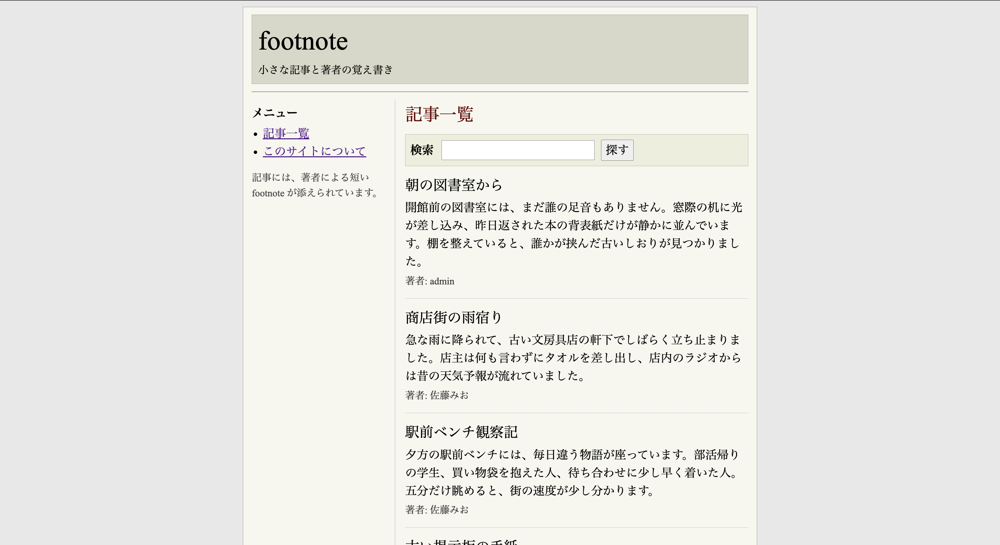

## 問題
```
記事には、著者だけが知っている小さな footnote が残されているようです。 [URL]
```
記事サイトですね

## 調査

とりあえずディレクトリを見る
```
> tree

.
├── app
│   ├── Dockerfile
│   ├── package-lock.json
│   ├── package.json
│   ├── prisma
│   │   ├── migrations
│   │   │   └── 20260606000000_init
│   │   │       └── migration.sql
│   │   ├── schema.prisma
│   │   └── seed.ts
│   ├── prisma.config.ts
│   ├── public
│   │   ├── index.html
│   │   └── style.css
│   ├── src
│   │   ├── db.ts
│   │   ├── filter.ts
│   │   └── server.ts
│   └── tsconfig.json
├── compose.yml
└── nginx
    ├── Dockerfile
    └── nginx.conf

  
8 directories, 16 files
```

わかること:
- `app/`配下について
  + `package.json`/`package-lock.json`/`tsconfig.json` -> Node.js + TypeScript
  + `src/server.ts` -> サーバー本体
  + `src/db.ts` -> DB接続層
  + `src/filter.ts` -> フィルタ処理が分離されたファイルにある．

- DBはPrisma ORM
  + `prisma/schema.prisma`,`prisma.config` -> Prisma ORMを使用している.
  + `prisma/migrations/../migration.sql` -> スキーマ定義(テーブルの構造がわかる)
  + `prisma/seed.ts` -> 初期データを投入するスクリプト？flagやadminのデータがありそう．
  + ORM経由なので，SQLインジェクションよりPrismaの`where`フィルタ構造を操作する系が怪しい


とりあえず怪しいファイル順に見ていく．
1. `src/filter.ts`
2. `src/server.ts`
3. `prisma/schema.prisma`
4. `prisma/seed.ts`

## src/filter.ts

25行目の`validateFilterField`という関数．
rootだけ検証して，以降のセグメントは正規表現しか見ていないことがわかる．
```ts
const ALLOWED_FILTER_ROOTS = new Set(["title", "body", "author"]);
const ALLOWED_OPERATORS = new Set(["eq", "contains", "startsWith"]);
const TO_ONE_RELATIONS = new Set(["author", "profile"]);
const FIELD_SEGMENT = /^[A-Za-z][A-Za-z0-9]*$/;

...

function validateFilterField(field: string) {
  const parts = field.split(".");
  const root = parts[0];

  if (!root || !ALLOWED_FILTER_ROOTS.has(root)) { //rootだけallowlist
    throw new InvalidFilterError();
  }

  for (const part of parts) {
    if (!FIELD_SEGMENT.test(part)) { //残りは英数字かだけ
      throw new InvalidFilterError();
    }
  }
}

```

- `ALLOWED_FILTER_ROOTS = {title, body, author}`のチェックは`root`のみ
- 二番目以降のセグメントは`FIELD_SEGMENT = /^[A-Za-z][A-Za-z0-9]*$/ `を満たすだけでよく，到達先フィールドのallowlistが存在しない．

つまり，`author.`で始めればUser -> Profileとリレーションを辿り，`secretMemo`を含む任意のスカラーフィールドへ潜れてしまう．`author.profile.secretMemo`は全セグメントが正規表現を通過してしまうっぽい．


buildNestedWhereという関数の68行目
```ts
const TO_ONE_RELATIONS = new Set(["author", "profile"]); 

...

function buildNestedWhere(
  parts: string[],
  condition: Record<string, string>,
): Record<string, unknown> {
  const [head, ...tail] = parts;

  if (!head) {
    throw new InvalidFilterError();
  }

  if (tail.length === 0) {
    return { [head]: condition };
  }

  const nested: Record<string, unknown> = buildNestedWhere(tail, condition);

  if (TO_ONE_RELATIONS.has(head)) {
    return { [head]: { is: nested } }; // ← リレーションを正しく is でラップ
  }

  return { [head]: nested };
}
```
- profileはrootには入れないが，`TO_ONE_RELATIONS`には入っている．つまりrootにはできないが，ネストの途中なら辿れるので，中間リレーションとして機能する．
- `buildNestedWhere`が`author`/`profile`を`{is: ... }`で包むため，`field=author.profile.secretMemo`からPrismaとして有効なリレーションフィルタが組み上がる．
  - `{ author: { is: { profile: { is: { secretMemo: { startsWith: value } } } } } }`


`buildStringCondition`という関数の40行目
```ts
const ALLOWED_OPERATORS = new Set(["eq", "contains", "startsWith"]);

...

function buildStringCondition(op: string, value: string) {
  if (!ALLOWED_OPERATORS.has(op)) {
    throw new InvalidFilterError();
  }

  if (op === "eq") {
    return { equals: value };
  }

  return { [op]: value }; // startsWith/containsがそのまま条件になる
}
```
- 使える演算子に`startsWith`がある．これがあると「secretMemoはxxで始まる？」という条件をフィルタとして投げられる．
- secretMemoの中身はレスポンスに出てこない（-> server.ts）ので直接は読めない．が，`startsWith`で前方一致をかけられるので，一致する記事が返るか否かでその真偽だけが分かる．
- これを1文字ずつ繰り返せば，中身を直接見ずにsecretMemoを端から復元できる．「中身は隠されているのにYes/Noだけ漏れる窓口」なのでブラインドオラクルと呼ばれるっぽい．

つまり，`field=author.profile.secretMemo`，`op=startsWith`，`value=xx`を投げて，ヒットの有無で1文字ずつ秘密を抜けるっぽい．

## src/filter.tsで分かったこと

- `/api/articles/search`の`field/op/value`で，検索フィルタを自由に組み立てられる．
- フィルタ検証(`validateFilterField`)はrootしか見ておらず，2番目以降のセグメントは正規表現だけ．到達先フィールドのallowlistが無い．
- そのため`author.profile.secretMemo`のように，本来出すつもりのない秘密カラムまでリレーションを辿れてしまう．
- `buildNestedWhere`が`author`/`profile`を`{ is: ... }`で包むので，Prismaとして有効なフィルタが組み上がる．
- `startsWith`が使えるので「secretMemoはxxで始まる？」と前方一致で質問でき，ヒット有無で真偽が1文字ずつ漏れる（ブラインドオラクル）．
- -> secretMemoを1文字ずつ復元できそう．ただし「復元したsecretMemoをどう使うのか」「レスポンスに何が返るのか」はserver.tsを見て確認する必要がある．

## src/server.ts
62行目，検索のエントリーポイント
```ts
app.get("/api/articles/search", searchLimiter, async (req, res) => {
  try {
    const filterWhere = isAdvancedSearch({
      field: req.query.field,
      op: req.query.op,
      value: req.query.value,
    })
      ? buildAdvancedWhere({ // フィルタ注入
          field: req.query.field,
          op: req.query.op,
          value: req.query.value,
        })
      : buildKeywordWhere(req.query.q); 
...

```

- `isAdvancedSearch`はfield/op/valueのどれか一つでもあれば`true`なので，`?field=&op=&value=`をつけるだけでbuildAdvancedWhereに入ることがわかる．

続きの76行目，実際の検索
```ts
const articleSelect = {
  id: true,
  title: true,
  body: true,
  author: {
    select: {
      profile: {
        select: {
          displayName: true,
          bio: true,
        },
      },
    },
  },
};

...

app.get("/api/articles/search", searchLimiter, async (req, res) => {

...

 const articles = await prisma.article.findMany({
      where: {
        AND: [{ published: true }, filterWhere],
      },
      orderBy: { id: "asc" },
      select: articleSelect,
    });

```
- 自分のフィルタが`published: true`とANDされ検索される
- `articleSelect`(26行目)が返すのは`id/title/body`と`author.profile.{displayName, bio}`だけ．`secretMemo`は入っていない．
	- filter.tsでの直接読めない，が確定
- 返るのはどの記事がヒットしたかだけ．adminの記事には`displayName: "admin"`が乗るので，それを信号として真偽を判定できる．


99行目，`POST /api/claim`（flagの出口）
```ts

app.post("/api/claim", claimLimiter, async (req, res) => {

...

  if (!admin?.profile || req.body.memo !== admin.profile.secretMemo) {
    res.status(403).json({ error: "forbidden" });
    return;
  }

  res.json({ flag }); // memoがadminのsecretMemoと一致したらflag
});
```
- `{ memo }`を投げてadminのsecretMemoと一致すればflagが返る．
- -> オラクルで復元したsecretMemoをそのままclaimに投げればいい．

## 現状で分かったこと
- エンドポイントは2つ．`GET /api/articles/search`（検索）と`POST /api/claim`（flag）．
- `isAdvancedSearch`はfield/op/valueのどれか1つでもあればtrueなので，`?field=&op=&value=`を付けるだけでbuildAdvancedWhere（注入経路）に入る．
- 検索は自分のフィルタが`published: true`とANDされる．返るのは`id/title/body`と`author.profile.{displayName, bio}`だけで，`secretMemo`は返らない（直接は読めない）．
- adminの記事には`displayName: "admin"`が乗るので，ヒットの有無＋displayNameで真偽を判定できる＝ブラインドオラクルが成立する．
- `POST /api/claim`に`{ memo }`を投げ，adminのsecretMemoと一致すればflagが返る．→ filter.tsのsecretMemoの使い道が解決．
- レート制限はsearch 300req/分．secretMemoは12桁hexなので最悪16×12=192クエリで枠に収まる＝総当たり可能．
- -> 「検索オラクルでsecretMemoを1文字ずつ復元 → claimに投げてflag」という攻撃の全体像が揃った．あとはこれを自動化するスクリプトを書くだけ．


## 実行
上記のことを踏まえて，スクリプトを書きました．
[solve_web.py](./solve_web.py)
```
> python3 ./solve_web.py 
[ 1/12] secretMemo = b
[ 2/12] secretMemo = b2
[ 3/12] secretMemo = b2f
[ 4/12] secretMemo = b2fa
[ 5/12] secretMemo = b2fa6
[ 6/12] secretMemo = b2fa6b
[ 7/12] secretMemo = b2fa6b5
[ 8/12] secretMemo = b2fa6b56
[ 9/12] secretMemo = b2fa6b560
[10/12] secretMemo = b2fa6b5600
[11/12] secretMemo = b2fa6b56005
[12/12] secretMemo = b2fa6b560059

admin secretMemo = b2fa6b560059
POST /api/claim -> 200: {"flag":"ctf4b{r00t_f13lds_4r3_n0t_en0ugh}"}
FLAG: ctf4b{r00t_f13lds_4r3_n0t_en0ugh}
```
フラグが見えました！やったー！！！
## 原因とか
- 根本的な原因は，`filter.ts`のフィールド検証(`validateFilterField`)がrootセグメントしかallowlistで見ていないこと．
- 2番目以降は正規表現(`/^[A-Za-z][A-Za-z0-9]*$/`)を通るだけなので，`author.profile.secretMemo`のように本来到達してはいけないリレーション/カラムまで潜れてしまった．
- さらに`buildNestedWhere`が`author`/`profile`を`{ is: ... }`で包み，Prismaとして有効な深いリレーションフィルタを組み立ててしまう．
- 結果，secretカラムを直接読めなくても`startsWith`で前方一致のブラインドオラクルが成立し，1文字ずつ復元 -> claimでflag．

## 参照
- [Prisma — Filtering and sorting](https://www.prisma.io/docs/orm/prisma-client/queries/filtering-and-sorting) — `where`での`equals`/`contains`/`startsWith`などの絞り込み演算子．
- [Prisma — Relation queries](https://www.prisma.io/docs/orm/prisma-client/queries/relation-queries) — リレーション越しのフィルタ（to-one を`is`で絞る構文）．`author.profile.secretMemo`が成立する根拠．
- [Prisma — Select fields](https://www.prisma.io/docs/orm/prisma-client/queries/select-fields) — `select`で返すフィールドを限定する仕組み（今回 secretMemo を返さない設定）．
- [OWASP — Blind SQL Injection](https://owasp.org/www-community/attacks/Blind_SQL_Injection) — 真偽の差分だけで1文字ずつ秘密を抽出する技法．本問のブラインドオラクルと同型．
- [OWASP — Input Validation Cheat Sheet](https://cheatsheetseries.owasp.org/cheatsheets/Input_Validation_Cheat_Sheet.html) — allowlist 検証の原則（root だけでなくフルパスを検証すべきだった話）．
