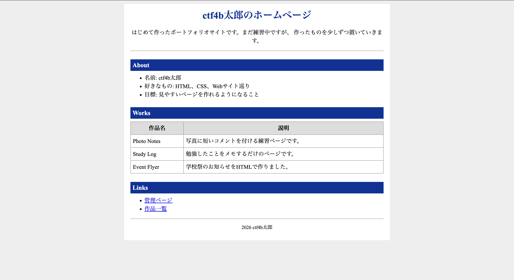

## 問題

`はじめて作ったポートフォリオサイトを公開しました。 [URL]`

ポートフォリオサイトですね，自分もいつか作ってみたいです．


## 調査
配布されたディレクトリをとりあえず見てみる．
```
> tree 

.
├── app
│   ├── Dockerfile
│   ├── index.js
│   ├── package-lock.json
│   ├── package.json
│   └── public
│       ├── admin.html
│       ├── flag.txt
│       ├── index.html
│       └── styles.css
├── compose.yaml
└── nginx
    ├── Dockerfile
    └── nginx.conf
```
このことからわかることは : 
- `flag.txt`,`admin.html`が`public/`の中にある．
- `package.json`で依存関係を見れそう

ということでとりあえず，`flag.txt`を見てみる．
```
> curl  http://portfolio.beginners.seccon.games:33455/flag.txt 

ctf4b{my_f1r57_p0r7f0l10_mistake}
```
flagが見えました!


## 原因とか

`index.js`の8行目に，
`app.use(express.static(publicDir));`とある．
`express.static`は`public/`ディレクトリ配下のファイルをそのまま全て配信するので`public/`ディレクトリにある`flag.txt`が普通に`GET`できました．

`index.js`の10行目に，
`app.get("/admin", (req, res) => {`
とあり，`/admin`ルートを守っているが，`public/`ディレクトリにある`admin.html`が静的配信で普通に`GET`ができます．
