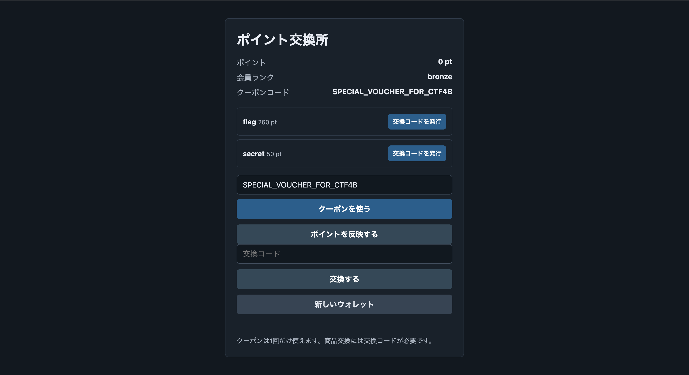

## 問題

```
クーポン引換をして、豪華賞品を手に入れよう！  [URL]
```

クーポン`SPECIAL_VOUCHER_FOR_CTF4B`を使うとポイントが貯まり，ポイントで景品（flag）を交換するショップ．配布の`README.md`（13〜18行目）にこうある:

```
- Initial points: 0 pt
- Coupon code: SPECIAL_VOUCHER_FOR_CTF4B
- The coupon gives points after the statement is prepared.
```

flagは260ptで交換．でもクーポン1枚で貰えるのは70ptだけっぽい．どうやって70->260にするか．


## 調査

ディレクトリを見る．

```
> tree

.
├── Dockerfile
├── README.md
├── compose.yaml
├── public
│   └── index.html
├── requirements.txt
└── src
    ├── app.py
    ├── schema.sql
    └── storage.py
```

わかること:
- `src/app.py` -> Flask本体っぽい．エンドポイントと残高まわりはここ．
- `src/storage.py` -> 名前からしてウォレット残高の保存/キャッシュ層っぽい．
- `src/schema.sql` -> SQLiteのスキーマ．テーブル構造がわかる．
- ORMなし・素のSQLiteなので，SQLiよりは残高まわりの整合性（raceとか）が怪しそう．

怪しい順に見ていく．
1. `src/schema.sql`（テーブル構造を先に把握）
2. `src/app.py`（エンドポイントと残高ロジック）
3. `src/storage.py`（キャッシュ）

## src/schema.sql

テーブルは`users`/`offers`/`customer_events`/`point_spends`の4つ．残高は`users.balance`（3行目）に入る．

気になるのは`customer_events`（16〜30行目）．

```sql
-- src/schema.sql : customer_events (16〜30行目)
CREATE TABLE IF NOT EXISTS customer_events (
    id INTEGER PRIMARY KEY AUTOINCREMENT,
    name TEXT NOT NULL,
    topic TEXT NOT NULL,
    principal TEXT NOT NULL,
    metadata TEXT NOT NULL,
    applied_at TEXT,
    locked_by TEXT,
    locked_until REAL,
    review_until REAL NOT NULL DEFAULT 0,
    early_refreshes INTEGER NOT NULL DEFAULT 0,
    claim_count INTEGER NOT NULL DEFAULT 0,
    created_at TEXT NOT NULL DEFAULT CURRENT_TIMESTAMP,
    UNIQUE(name, topic, principal)
);
```

`locked_until`/`claim_count`/`applied_at`みたいな「ロックして1回だけ処理する」系のカラムがイベントに付いてる．こういうロックの実装はだいたい隙があるので，`app.py`側の使い方を重点的に見る．`UNIQUE(name, topic, principal)`（29行目）も後で効いてくる．

## src/app.py

まず値段．`quote_price`（493〜498行目）．

```python
# src/app.py : quote_price (493〜498行目)
def quote_price(item: str):
    if item == "flag":
        return 260
    if item == "secret":
        return 50
    return None
```

flagは260pt．次にクーポンを使う`/redeem`（620〜649行目）．中で`register_offer_event`（425〜453行目）->`write_customer_event`（434〜443行目）を呼んでイベントを1個作る．

```python
# src/app.py : register_offer_event 内 (434〜443行目)
        created = write_customer_event(
            conn,
            user_id,
            offer["event"]["name"],
            code,
            {
                "delta": int(offer["wallet"]["delta"]),
                "template": offer["document"]["template"],
            },
        )
```

`offer["wallet"]["delta"]`は`init_db`（56〜67行目）のクーポン登録で70が入る．`write_customer_event`（263〜272行目）は`INSERT OR IGNORE`．

```python
# src/app.py : write_customer_event (263〜272行目)
def write_customer_event(conn, user_id: str, name: str, topic: str, metadata: dict):
    cursor = conn.execute(
        """
        INSERT OR IGNORE INTO customer_events (name, topic, principal, metadata)
        VALUES (?, ?, ?, ?)
        """,
        (name, topic, user_id, json.dumps(metadata, separators=(",", ":"))),
    )
    return cursor.rowcount == 1
```

`INSERT OR IGNORE`（266行目）とさっきの`UNIQUE(name, topic, principal)`（schema.sql 29行目）が合わさると，同じクーポンでイベントは1個しか作れない．だから素直にやると70ptが上限で，260には届かない．70を水増しする方法を探す．

残高の出し方が3通りあってややこしいので先に整理する:
1. キャッシュ（`src/storage.py`の`WALLET_CACHE`）— `read_wallet_balance`（115〜127行目）が最初に見る値．
2. DBの`users.balance` — キャッシュが無いときのフォールバック．
3. canonical — `canonical_wallet_balance`（137〜163行目）．適用済みイベントのdelta合計から`point_spends`を引いた“本当の残高”．

```python
# src/app.py : canonical_wallet_balance (137〜163行目)
def canonical_wallet_balance(conn, user_id: str):
    rows = conn.execute(
        """
        SELECT metadata
        FROM customer_events
        WHERE principal = ?
          AND applied_at IS NOT NULL
        ORDER BY id
        """,
        (user_id,),
    ).fetchall()

    total = 0
    for row in rows:
        metadata = json.loads(row["metadata"])
        total += int(metadata.get("delta", 0))

    spent = conn.execute(
        """
        SELECT COALESCE(SUM(cost), 0) AS total
        FROM point_spends
        WHERE principal = ?
        """,
        (user_id,),
    ).fetchone()
    total -= int(spent["total"])
    return total
```

`applied_at IS NOT NULL`のイベントだけを合計するので，イベントが1個（delta=70）だとcanonicalは70．監査（`normalize_wallet_cache` 166〜184行目）が走ると残高はこのcanonicalで上書きされ，必ず70に戻る．つまり「監査が来る前」だけ別の値にできる．

クーポンの70ptを確定させるのは`/support/statement`（652〜664行目）．中身は`reconcile_statement_batch`（456〜480行目）．

```python
# src/app.py : reconcile_statement_batch (456〜480行目)
def reconcile_statement_batch(user_id: str):
    with db() as conn:
        event, token, render_delay, audit_delay = claim_statement_ticket(conn, user_id)
    if event is None:
        return {"accepted": True}

    metadata = json.loads(event["metadata"])
    balance_before = read_wallet_balance(user_id)
    document_id = make_statement_package(
        user_id,
        event["topic"],
        balance_before,
        metadata["template"],
        render_delay,
    )
    metadata["document"] = document_id

    with db() as conn:
        balance = post_ledger_adjustment(conn, user_id, int(metadata["delta"]))
        update_loyalty_profile(conn, user_id, balance)
        close_statement_ticket(conn, int(event["id"]), token, metadata)

    schedule_wallet_audit(user_id, audit_delay)

    return {"accepted": True}
```

順番が変．`post_ledger_adjustment`（213〜225行目）で残高に+70してから，`close_statement_ticket`（321〜335行目，`applied_at`を立てるのは325行目）でイベントを「適用済み」にしている．しかもその間に`make_statement_package`（409〜422行目）があり，中で`sleep(render_delay)`している（417行目）．

```python
# src/app.py : make_statement_package (409〜422行目)
def make_statement_package(user_id, code, balance, template, render_delay):
    issued_at = f"{time():.6f}"
    sleep(render_delay)
    return hmac.new(
        APP_SECRET,
        f"{user_id}:{code}:{balance}:{template}:{issued_at}".encode(),
        hashlib.sha256,
    ).hexdigest()[:24]
```

お金は先に渡して，済んだ印は後で付ける状態．ここに別のstatementが割り込めれば，同じイベントで何度も+70できそう．割り込めるかはロック次第なので`claim_statement_ticket`（338〜406行目）を見る．

```python
# src/app.py : claim_statement_ticket (358〜394行目, 抜粋)
    if float(row["review_until"] or 0) > now:
        return None, None, None, None

    lease, render_delay, audit_delay = statement_timing(user_id, event_id)

    if float(row["locked_until"] or 0) > now:
        record_early_refresh(conn, event_id, now)
        return None, None, None, None

    if int(row["claim_count"] or 0) >= reprint_limit:
        return None, None, None, None

    cursor = conn.execute(
        """
        UPDATE customer_events
        SET locked_by = ?,
            locked_until = ?,
            early_refreshes = 0,
            claim_count = COALESCE(claim_count, 0) + 1
        WHERE id = ?
          AND principal = ?
          AND applied_at IS NULL
          AND COALESCE(review_until, 0) < ?
          AND COALESCE(locked_until, 0) < ?
          AND COALESCE(claim_count, 0) < ?
        """,
        (token, now + lease, event_id, user_id, now, now, reprint_limit),
    )
```

ロックは`locked_until`のリース方式．`reprint_limit`は341行目で5．そのリース時間を作るのが`statement_timing`（274〜283行目）．

```python
# src/app.py : statement_timing (274〜283行目)
def statement_timing(user_id: str, event_id: int):
    seed = hmac.new(
        RACE_SALT,
        f"statement:{user_id}:{event_id}".encode(),
        hashlib.sha256,
    ).digest()
    lease = (90 + seed[0] % 141) / 1000.0
    render_ratio = 1.25 + (seed[1] / 255.0) * 0.40
    audit_ratio = 8.0 + (seed[2] / 255.0) * 4.0
    return lease, lease * render_ratio, lease * audit_ratio
```

ここでわたくし気づきました:
- ロックの寿命は`lease`（280行目，90〜230ms）．
- でも処理中のsleepは`render_delay = lease * render_ratio`（281行目，render_ratioは1.25〜1.65）で，leaseより長い．
- つまり「ロックは切れてるのに，まだ`applied_at`が立ってない」時間が必ずできる（`render_delay - lease`ぶん）．
- その隙に次の`/support/statement`を撃てば，同じイベントをもう一回claimできてまた+70．`claim_count`は5まで通る（368行目）ので，1枚のクーポンで最大5×70=350ptまで盛れる．

ただし早すぎ請求（lease中＝`locked_until > now`）に撃つと`record_early_refresh`（286〜318行目）が呼ばれ，3回を超えると`review_until = now + 1.2`で1.2秒ロックアウトされる（308行目）．連打はダメで，「leaseが切れた直後・`applied_at`より前」を狙う必要がある．leaseはHMAC seed由来で毎回違う（90〜230ms）ので，間隔を振って当てにいく．

それと時間制限．`schedule_wallet_audit`（483〜490行目）が`audit_delay = lease * audit_ratio`（282行目，audit_ratioは8〜12，だいたい0.7〜2.8秒後）に走り，canonical（=70）で残高を上書きする．監査が来る前にflagを買い切る必要がある．

買い方は`/cart/quote`（667〜678行目）->`/exchange`（720〜740行目）．quoteは`issue_checkout_quote`（501〜553行目）で発行時のbalanceを署名ペイロードに封入する．

```python
# src/app.py : issue_checkout_quote (508〜521行目)
    if balance >= price:
        expires_at = now + 30.0
        payload = {
            "sub": user_id,
            "item": item,
            "balance": balance,
            "exp": expires_at,
            "nonce": secrets.token_urlsafe(8),
        }
        body = base64.urlsafe_b64encode(
            json.dumps(payload, separators=(",", ":")).encode()
        ).decode().rstrip("=")
        sig = hmac.new(APP_SECRET, body.encode(), hashlib.sha256).hexdigest()
        return f"{body}.{sig}"
```

一度balance>=260でquoteを取れれば，あとで監査で残高が戻ってもquote自体は有効（exp30秒）．`/exchange`がそのquoteを検証してflagを返す（734行目）．

## src/storage.py

残高キャッシュは`src/storage.py`のメモリ（`WALLET_CACHE` 7行目，`cache_get` 13〜19行目）．

```python
# src/storage.py : WALLET_CACHE / cache_get (7〜19行目)
WALLET_CACHE = OrderedDict()
CACHE_LOCK = Lock()
MAINTENANCE_LOCK = Lock()
LAST_MAINTENANCE = 0.0


def cache_get(user_id: str):
    with CACHE_LOCK:
        if user_id not in WALLET_CACHE:
            return None
        value = WALLET_CACHE.pop(user_id)
        WALLET_CACHE[user_id] = value
        return value
```

プロセス内の`OrderedDict`なだけでDBとは別物．`read_wallet_balance`がまずこれを見るので，水増し中はキャッシュの値で動く．監査の`normalize_wallet_cache`がここをcanonicalで上書きして整合を取り直す，という関係．

## 分かったこと

- クーポンはdelta=70の保留イベントを1個だけ作る（`src/app.py` 266行目`INSERT OR IGNORE`＋`src/schema.sql` 29行目`UNIQUE`）．素直には70pt上限で260に届かない．
- `/support/statement`のreconcile（456〜480行目）は残高+70（`post_ledger_adjustment` 213〜225行目）->`applied_at`（`close_statement_ticket` 321〜335行目）の順で，間にsleep（417行目）がある．お金が先で印が後．
- ロックlease（280行目，90〜230ms）より処理render_delay（281行目，lease×1.25〜1.65）が長いので，ロック切れ〜適用前の隙で同じイベントを再claimでき，`claim_count`<=5（368行目）まで+70を多重計上できる．
- 早すぎ請求はペナルティ（308行目，1.2sロックアウト）なので，間隔を振って隙に当てる．
- audit（483〜490行目，lease×8〜12後）が70に戻すので，その前にflagのquoteを取ってexchange（720〜740行目）すればflag．
- -> 「redeem ->間隔を振りながらstatementを数発 ->balance>=260を観測 ->quote ->exchange」を自動化すればよさそう．

## 実行

上記を踏まえてスクリプトを書きました．
[solve_web.py](./solve_web.py)

やっていること:
- 間隔`INTERVALS`（0.085〜0.4秒）を順に試し，各間隔で`/support/statement`を6発，狙ったタイミングで撃つ（`fire_statements`）．
- 毎回トップページから残高をスクレイプしてbestを更新，`/cart/quote {item:flag}`->`/exchange`でflagを試す．

```
> python3 ./solve_web.py
interval=0.0850s  balance= 210  best= 210
interval=0.0850s  balance= 140  best= 210
interval=0.0925s  balance= 140  best= 210
interval=0.0925s  balance= 210  best= 210
interval=0.1000s  balance= 210  best= 210
interval=0.1000s  balance= 210  best= 210
interval=0.1075s  balance= 350  best= 350  <-- ctf4b{Th4nk_y0u_f0r_y0ur_pur<ha5e}

FLAG: ctf4b{Th4nk_y0u_f0r_y0ur_pur<ha5e}
```


## 原因とか

- 「加算」と「適用済みマーク」が別タイミングになっている．`post_ledger_adjustment`（+70, 213〜225行目）を先に確定して`close_statement_ticket`（applied_at, 321〜335行目）を後で立てるので，その隙に同じイベントを何度も換金できてしまう．1トランザクション内で「未適用なら適用＆加算」を原子的にやるべきだった．
- ロックが処理時間より短い．`statement_timing`（274〜283行目）でlease < render_delayなので，ロックで直列化したつもりが必ず隙ができる．ロックは処理が終わる（applied_atが立つ）まで持たせるべきだった．
- 正規化が事後．監査（`normalize_wallet_cache` 166〜184行目）で必ず70に戻るのに，その前に署名付きquoteを取れば既成事実化できる．残高チェックは交換時点のcanonicalでやるべきだった．
- これらが重なって，1枚70ptのクーポンを260pt以上に膨らませてflagを取れてしまった．

## 参照
- [OWASP — Race Condition / TOCTOU](https://owasp.org/www-community/vulnerabilities/Race_Conditions) — 確認と使用の間に状態が変わるバグ．今回の多重換金そのもの．
- [CWE-362: Concurrent Execution using Shared Resource ('Race Condition')](https://cwe.mitre.org/data/definitions/362.html) — 共有リソース（残高・イベント状態）の競合．
- [CWE-367: Time-of-check Time-of-use (TOCTOU)](https://cwe.mitre.org/data/definitions/367.html) — ロック切れ〜applied_atの隙を突く構造の分類．
- [SQLite — Transaction / BEGIN IMMEDIATE](https://www.sqlite.org/lang_transaction.html) — 「未適用なら適用＆加算」を原子的にやるための排他トランザクション．
